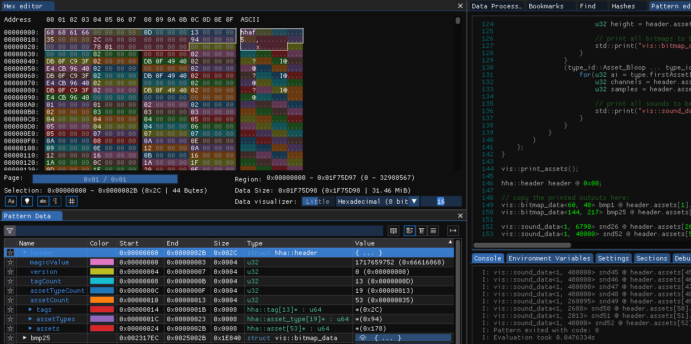

# Miscellaneous

1. [LLVM MCA output](llvm_mca_output.md) for the specific day.
2. [Execuration units and port details](cpu_details.md).
3. *.hha [pattern file](hha.hexpat) and [plugin](https://github.com/MzaxnaV/EnhancedBitmapVisualizer) for [ImHex editor](https://imhex.werwolv.net/) works on v1.32.2.
    
4. HHA File Content Sizes:
    ```
    Header:
            BytesToWrite: 44
            BytesWritten: 44
    Tags:
            BytesToWrite: 104
            BytesWritten: 104
    Asset Types:
            BytesToWrite: 228
            BytesWritten: 228
    Bitmap filename structured_art.bmp:
            DataSize: 9600
            BytesToWrite: 9600
            BytesWritten: 9600
    
    ...

    Sound filename wave_stereo_test_1sec.wav:
    0:      DataSize: 96000
    0:      BytesToWrite: 96000
    0:      BytesWritten: 96000
    ```