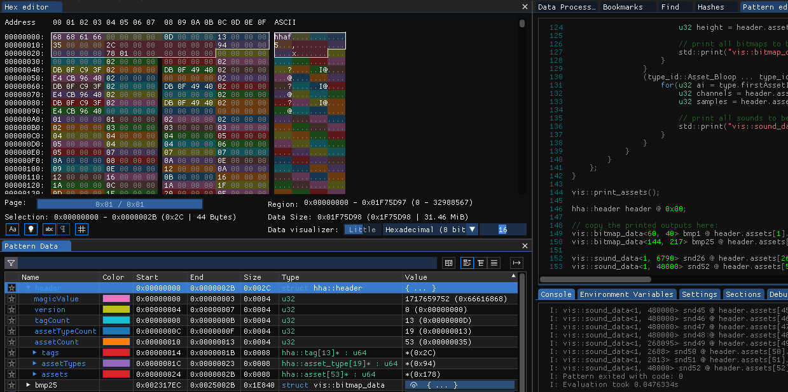

# Miscellaneous

1. [LLVM MCA output](llvm_mca_output.md) for the specific day.
2. [Execuration units and port details](cpu_details.md).
3. *.hha [pattern file](hha.hexpat) and [plugin](https://github.com/MzaxnaV/EnhancedBitmapVisualizer) for [ImHex editor](https://imhex.werwolv.net/) works on v1.32.2.
    